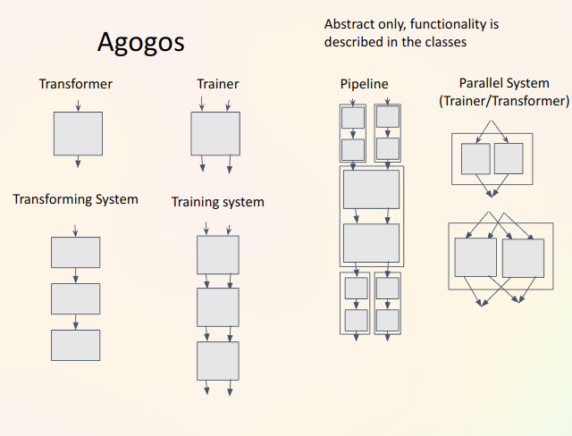

<p align="center">
    
</p>

<h1 align="center">Agogos</h1>

[](https://pypi.org/project/agogos/)
[](https://pypi.org/project/agogos/)

This package contains many modules and classes necessary to construct the ml pipeline for machine learning competitions.

## Description

<p align="center">
    
</p>

## Pytest coverage report

To generate pytest coverage report run

```shell
pytest --cov=agogos --cov-report=html:coverage_re
```

## Documentation

Documentation is generated using [Sphinx](https://www.sphinx-doc.org/en/master/).

To make the documentation, run `make html` with `docs` as the working directory. The documentation can then be found in `docs/_build/html/index.html`.

Here's a short command to make the documentation and open it in the browser:

```shell
cd ./docs/;
./make.bat html; start chrome file://$PWD/_build/html/index.html
cd ../
```
